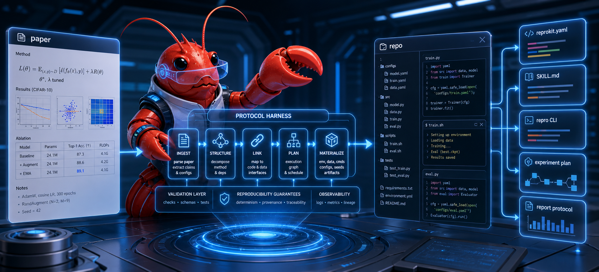

<div align="center">
    <h1 align="center">
    &nbsp;
    PaperHarness
    </h1>
</div>

<p align="center">
  <strong>
  Compile papers and repos into agent-operable reproduction kits.
  </strong>
</p>
<p align="center">
  <strong>
  Build the missing harness between research papers, code repositories, and coding agents.
  </strong>
</p>



[](https://github.com/plll4zzx/paper-harness/actions/workflows/ci.yml)

PaperHarness turns a paper and its repository into an agent-ready reproduction kit.

It helps coding agents understand what a paper is trying to reproduce, where the relevant implementation lives, which commands already exist, what needs to be checked first, and how to collect evidence for a reproducibility report.

```text
paper + repository
        |
        v
PaperHarness
        |
        v
agent-ready reproduction kit
        |
        v
Codex / OpenClaw / Claude Code / OpenCode
````

A generated kit contains:

* `reprokit.yaml`
* an agent skill
* a generated `repro` CLI
* an experiment plan
* a report protocol
* missing-information and review diagnostics

With PaperHarness, an agent does not need to rediscover the whole repository every time it attempts an experiment. It gets a structured protocol for setup, smoke tests, experiment execution, metric collection, and reporting.

## Why PaperHarness?

Reproducing a paper from its released codebase is often hard before any experiment even runs.

You open the paper and the repository, but it is not obvious where to start.

The paper may describe algorithms, variables, datasets, metrics, ablations, and tables in one language, while the repository implements them using different file names, config keys, scripts, modules, or internal abstractions.

For humans, this means a lot of manual tracing.

For coding agents, the problem is even worse.

Agents often have to:

* scan many files before finding the right entrypoints
* infer how paper concepts map to code variables
* rediscover existing training, evaluation, and data utilities
* inspect configs and scripts repeatedly for each experiment
* guess which commands are safe to run
* miss existing functionality and write duplicate helper scripts
* burn context window and tokens on repeated repository exploration
* debug failures without a stable experiment protocol

This leads to slow reproduction attempts, unnecessary script generation, repeated mistakes, and expensive debugging loops.

PaperHarness addresses this by generating a reusable reproduction kit before the experiment starts.

The kit gives the agent a stable operating surface:

```text
analyze once
    |
    v
generate kit
    |
    v
follow repro protocol
    |
    v
preserve logs, metrics, artifacts, and report
```

## What PaperHarness Generates

Given a paper and a repository, PaperHarness creates:

* `reprokit.yaml`: the machine-readable source of truth for the kit
* `skill/SKILL.md`: an agent skill for the specific paper/repo pair
* `skill/scripts/repro.py`: a generated experiment runner CLI
* `experiment_plan.md`: a human- and agent-readable execution plan
* `report_template.md`: a reproducibility report protocol
* `missing_info.md`: blocking gaps such as missing datasets, checkpoints, commands, or setup information
* `review_required`: non-blocking review items such as paper symbols that do not map cleanly to code variables
* `skill/references/`: paper summary, repo summary, experiment map, expected results, and risks

The generated kit helps an agent answer practical questions before running expensive experiments:

* What experiments does the paper describe?
* Which repository files, configs, and scripts appear relevant?
* Which commands already exist?
* Which paper results are mapped, unmapped, blocked, or partial candidates?
* Which paper variables are unmatched in code?
* Which datasets, checkpoints, seeds, or hyperparameters are missing?
* Which smoke tests should pass before full training?
* What logs, metrics, artifacts, and environment details should be collected?
* What should go into the final reproducibility report?

## Core Idea

PaperHarness behaves like a compiler for research artifacts.

```text
paper + repository
        |
        v
paper facts + repo facts
        |
        v
ReproKit IR
        |
        v
skill + CLI + experiment plan + report protocol
        |
        v
coding agent executes experiments with structure and context
```

The goal is not to make blind claims about reproducibility.

The goal is to make the reproduction workflow explicit, reusable, and auditable.

If a paper variable does not map cleanly to code, or if the released repository appears to implement only part of an experiment, PaperHarness records that uncertainty instead of hiding it.

## Quickstart

The current MVP supports local repository paths.

If you have a GitHub URL, clone it first, then pass the local checkout path to `--repo`.

```bash
git clone https://github.com/plll4zzx/paper-harness.git
cd paper-harness

python -m pip install -e ".[dev]"
```

Generate a reproduction kit from the included example:

```bash
paperharness build \
  --paper examples/minimal_pytorch/paper.txt \
  --repo examples/minimal_pytorch/repo \
  --out /tmp/paperharness-output \
  --force
```

Inspect the generated kit:

```bash
paperharness validate /tmp/paperharness-output

cd /tmp/paperharness-output/skill

python scripts/repro.py inspect
python scripts/repro.py list
python scripts/repro.py validate
python scripts/repro.py smoke
python scripts/repro.py report
```

Run tests from the project root:

```bash
pytest
```

## Generated Kit Layout

A generated kit looks like this:

```text
paperharness-output/
  reprokit.yaml
  experiment_plan.md
  report_template.md
  missing_info.md

  skill/
    SKILL.md
    scripts/
      repro.py
      setup_env.py
      smoke_test.py
      run_experiment.py
      evaluate.py
      collect_results.py
      write_report.py
    references/
      paper_summary.md
      repo_summary.md
      experiment_map.md
    assets/
      report_template.md
```

## Generated Agent Workflow

The generated `repro` CLI gives agents a safe execution path:

```bash
python scripts/repro.py inspect
python scripts/repro.py list
python scripts/repro.py validate
python scripts/repro.py status
python scripts/repro.py setup
python scripts/repro.py smoke
python scripts/repro.py prepare-data
python scripts/repro.py run <experiment_id>
python scripts/repro.py evaluate <experiment_id>
python scripts/repro.py collect
python scripts/repro.py report
```

The generated skill tells the agent how to use this CLI for one specific paper/repo pair.

A typical workflow is:

```text
inspect the kit
    |
    v
list available experiments
    |
    v
validate kit structure
    |
    v
set up environment
    |
    v
run smoke tests
    |
    v
prepare data if possible
    |
    v
run one experiment
    |
    v
evaluate metrics
    |
    v
collect logs and artifacts
    |
    v
write reproducibility report
```

This helps agents avoid launching expensive runs before basic setup and smoke checks pass.

## Install the PaperHarness Agent Skill

This repository includes a PaperHarness usage skill at:

```text
skills/paperharness/SKILL.md
```

An agent can install it by copying that directory into its skill directory.

For Codex-style skills:

```bash
mkdir -p ~/.codex/skills
cp -R skills/paperharness ~/.codex/skills/
```

After installation, the agent should use the PaperHarness skill whenever it is given:

* a research paper PDF, text, markdown, or arXiv-derived text
* a local repository path
* a request to reproduce, audit, inspect, or plan experiments

The installed PaperHarness skill teaches the agent how to run this generator.

The generator then creates a second skill specific to the target paper and repository.

```text
PaperHarness skill
  teaches the agent how to generate kits

Generated reproduce skill
  teaches the agent how to operate one specific paper/repo kit
```

## Core CLI

```bash
paperharness build --paper ./paper.pdf --repo ./repo --out ./paperharness-output

paperharness build --paper ./paper.pdf --repo ./repo --out ./paperharness-output --force

paperharness analyze-paper ./paper.pdf

paperharness analyze-repo ./repo

paperharness generate \
  --ir ./paperharness-output/reprokit.yaml \
  --out ./paperharness-output-regenerated \
  --force

paperharness validate ./paperharness-output

paperharness export ./paperharness-output --target codex
```

`paperharness build` and `paperharness generate` fail safely if the output directory already exists.

Pass `--force` only when you want to replace the generated output directory.

PaperHarness refuses to use the source paper or source repository path as the output directory.

## Review Required

PaperHarness separates blocking missing information from non-blocking review items.

`missing_info` is reserved for gaps that may block execution, such as:

* missing setup commands
* missing dataset instructions
* missing checkpoints
* missing evaluation commands
* missing required files

`review_required` is for issues that an agent or human should inspect before trusting a result, but that may not block execution.

For example, if the paper mentions symbols such as `alpha`, `beta`, `lambda`, and `lr`, but the repository uses different variable names or does not expose those variables, the generated `reprokit.yaml` records:

* experiment ID
* issue type, such as `unmatched_paper_symbols`
* symbols
* severity
* message

Generated `missing_info.md` and `python scripts/repro.py inspect` both show these review items.

This makes uncertainty visible instead of forcing the agent to guess.

## Reproducibility Levels

PaperHarness uses explicit reproducibility levels:

| Level   | Meaning                                                        |
| ------- | -------------------------------------------------------------- |
| Level 0 | Parsed paper and repository                                    |
| Level 1 | Mapped paper experiments to likely repository commands         |
| Level 2 | Setup and smoke tests are runnable                             |
| Level 3 | At least one full experiment produced metrics within tolerance |
| Level 4 | Results were verified across seeds or environments             |

The MVP mostly targets Level 0 and Level 1, with smoke-test support for moving toward Level 2.

## Current Status

PaperHarness is currently a runnable MVP.

Current CI verifies:

* editable install
* tests
* CLI help
* example kit generation
* kit validation
* generated `repro.py inspect`
* generated `repro.py list`
* generated `repro.py validate`
* generated `repro.py report`

The MVP supports:

* local paper text, markdown, and PDF input
* local Python research repositories
* heuristic command detection
* heuristic paper result extraction
* conservative experiment matching
* generated Codex-style reproduce kits
* generated CLI validation
* conservative smoke tests
* structured review items

Remote GitHub URLs are not directly supported by `--repo` yet.

Use:

```bash
git clone <repo-url>
```

then pass the local checkout path to `--repo`.

## Roadmap

Planned next:

* remote GitHub URL cloning
* stronger command matching
* structured evidence sources for experiment mappings
* better paper table and figure extraction
* improved repo utility discovery
* optional LLM-assisted paper/code alignment
* Codex, OpenClaw, Claude Code, and OpenCode export profiles
* richer reproducibility reports

## Design Philosophy

PaperHarness focuses on the preparation layer of paper reproduction.

Its job is to turn a paper and repository into a clear, reusable, agent-operable protocol.

The generated kit gives coding agents the context and commands they need to inspect, set up, run, evaluate, and report experiments.

PaperHarness does not assume that every released repository fully reproduces every result in the paper.

Instead, it makes uncertainty explicit.

Missing datasets, unclear checkpoints, unmatched paper symbols, ambiguous configs, partial implementations, and unsafe assumptions are surfaced as missing information or review items.

That makes paper reproduction workflows more systematic, auditable, and efficient for both humans and agents.


